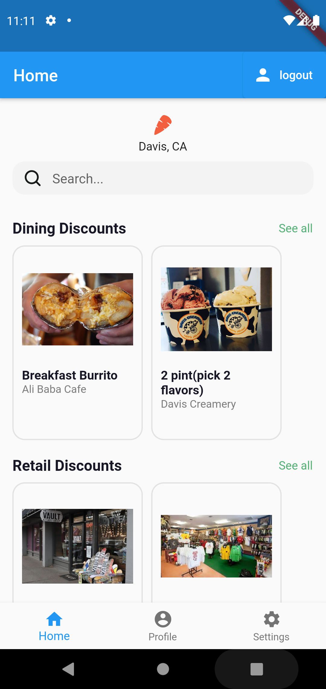

### updating a repo
git add .\
git commit -m "comment"\
git pull "github repo url" main\
git push --force "github repo url"

  
### Merging the repo (when somebody updated the repo) to your local copy

git add .\
git fetch\
git merge origin/main

# Overview

Updated Version

      

Version 1 Home Page

